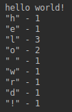
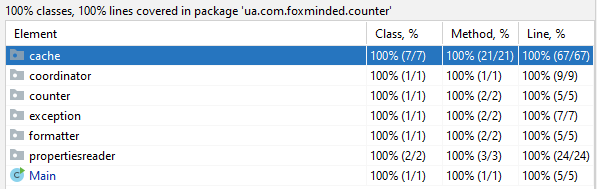

`Task 5 - Collection Framework`
Write an application char-counter that takes a string and returns the number of unique characters in the string.

It is expected that a string with the same character sequence may be passed several times to the method.

Since the counting operation can be time-consuming, the method should cache the results, so that when the method is given a string previously encountered,

it will simply retrieve the stored result. Use collections and maps where appropriate.

E.g.

Example of result:



`Instuction how run applicatian char-counter:`

Download and install java  https://www.java.com/ru/download/manual.jsp

Your mast put file Main.java
>*\ua\com\foxminded\counter\

Your mast put file Exception.java
>*ua\com\foxminded\counter\exception

Your mast put file Counter.java
>*ua\com\foxminded\counter\uniquechars


For exampl 

>C:\ua\com\foxminded\counter\

* Run Command Prompt

 >set path=%path%;C:\Program Files\Java\jdk1.*.*\bin

* This tells the system where to find JDK programs.

 >javac C:\ua\com\foxminded\counter\*.java*
 
 >javac C:\ua\com\foxminded\counter\*\*.java*

* This runs javac.exe, the compiler. You should see nothing but the next system prompt...

 >C:\ua\com\foxminded\counter\*
```
javac has created the Counter.class and Main.class, Exception.class file. 
You should see Counter.class, Main.class, Exception.class and Counter.java, 
Main.java, Exception.java among the files.
```

* This makes C:\ the current directory.

 >cd C:\

* This runs the Java interpreter. Then you can input sentence.

>java ua.com.foxminded.counter.Main 
Hello World!


```
If the system cannot find javac, check the set path command. If javac runs but you get errors, cell developers.
```
* You version.


`Unit tests`
 
 